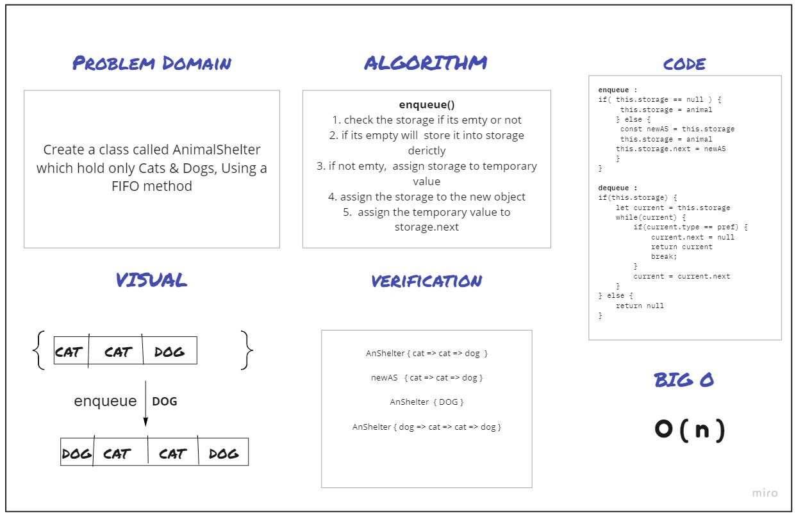

# Challenge Summary
Create a class called AnimalShelter which hold only Cats & Dogs, Using a FIFO method
## Whiteboard Process

## Approach & Efficiency
Big O ===> O ( n )

## Solution

```

AnShelter { cat => cat => dog  }

newAS   { cat => cat => dog }

AnShelter  { DOG }

AnShelter { dog => cat => cat => dog }

```
