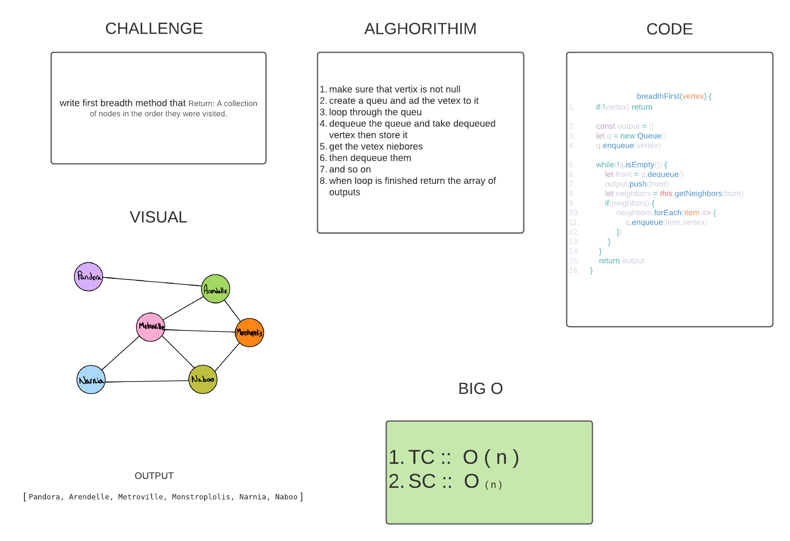

## Graphs
Graphs is a non-linear data structure that can be looked at as a collection of vertices (or nodes) potentially connected by line segments named edges.
## Challenge
### implement an Adjacency List Graph with some methods 
+ add vertex
+ add edge
+ get nodes
+ get neighbors
+ size
+ graph-breadth-first

## Approach & Efficiency
Logic Sequence 

## API
1. add node
Returns: The added node
Add a node to the graph
2. add edge
nodes to be connected by the edge, weight (optional)
3. get nodes
Returns all of the nodes in the graph as a collection (set, list, or similar)
4. get neighbors
Returns a collection of edges connected to the given node
5. size
Returns the total number of nodes in the graph
6. graph-breadth-first 
Return A collection of nodes in the order they were visited.

----------------------------------------------------------

## graph-breadth-first 
### Challenge
Return A collection of nodes in the order they were visited.
### Solution

