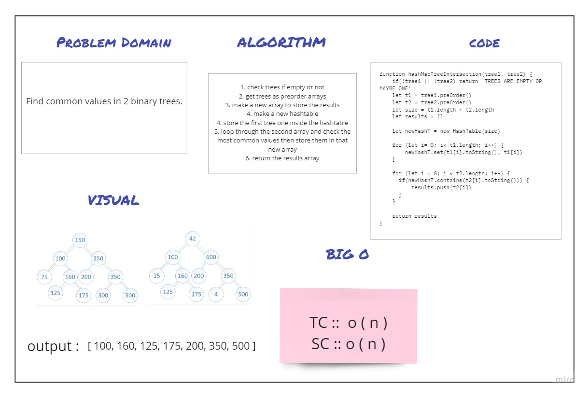

# Challenge Summary
Find common values in 2 binary trees.

## Feature Tasks
```

Find all values found to be in 2 binary trees

Write a function called tree intersection
Arguments: two binary trees
Return: array

```
## Approach & Efficiency
+  TC ``O(n)``
+  SC ``O(n)``


## Solution


