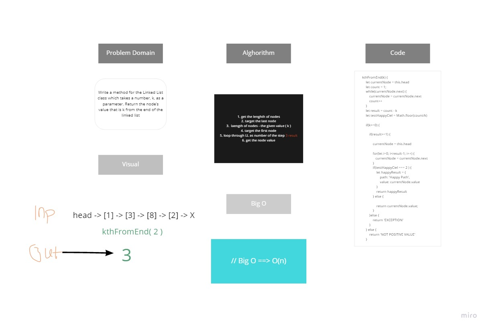

## ------------------------------------ CODE 06 ------------------------------------------


## Challenge Summary
create methods that handle with linked list to insert after and before a node.

## Challenge Description

```
I have been asked about  extend the linked list class before, add two methods both take 2 arg , the first one to add after a node, and the second to add before

```

## Approach & Efficiency

Logical thinking & solving step by step 

## Solution


## ------------------------------------ CODE 07 ------------------------------------------


## Challenge Summary
 Return the node’s value that is k from the end of the linked list
 
## Challenge Description

```
Write a method for the Linked List class which takes a number, k, as a parameter. Return the node’s value that is k from the end of the linked list

```

## Approach & Efficiency

Logical thinking & solving step by step 

## Solution


