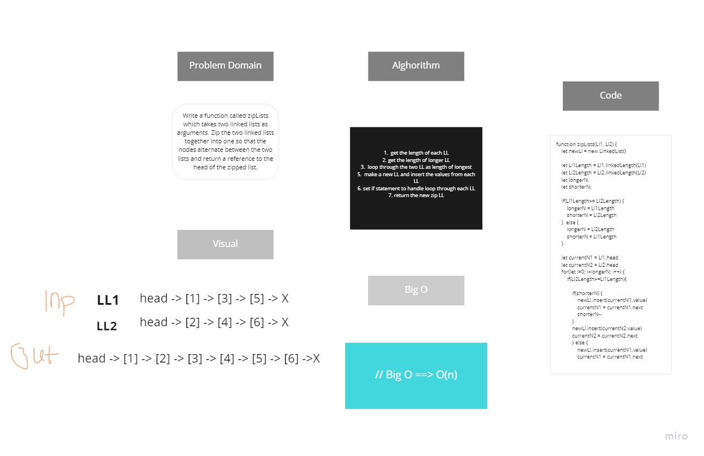

## Challenge Summary
It was a big challenge actually, it takes a lot of time to solve it, but eventaully i did it 
## Challenge Description

```
Write a function called zipLists which takes two linked lists as arguments. Zip the two linked lists together into one so that the nodes alternate between the two lists and return a reference to the head of the zipped list.
```

## Approach & Efficiency

Logical thinking & solving step by step 

## Solution


