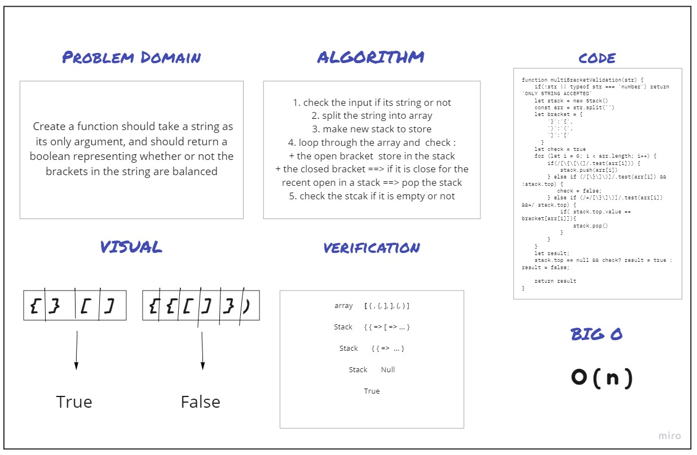

# Challenge Summary
Create a function should take a string as its only argument, and should return a boolean representing whether or not the brackets in the string are balanced
## Whiteboard Process

## Approach & Efficiency
Big O ===> O ( n )

## Solution

```

array      [ { , {, ], ], (, ) ]

Stack      { { => [ => ... }

Stack       { { =>  ... }

Stack       Null

True


```
