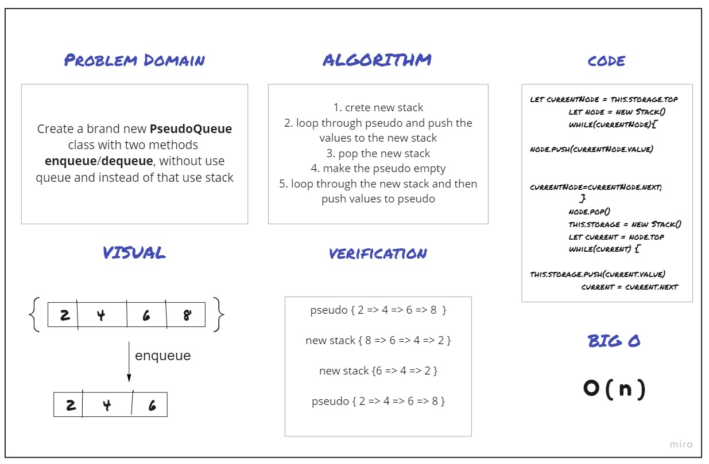

# Challenge Summary
Create Pseudo class with two methods enqueue/dequeue, and use Stack methods to implement it  

## Whiteboard Process

## Approach & Efficiency
Big O ===> O ( n )

## Solution

```

pseudo { 2 => 4 => 6 => 8  }

new stack { 8 => 6 => 4 => 2 }

new stack {6 => 4 => 2 }

pseudo { 2 => 4 => 6 => 8 }

```


