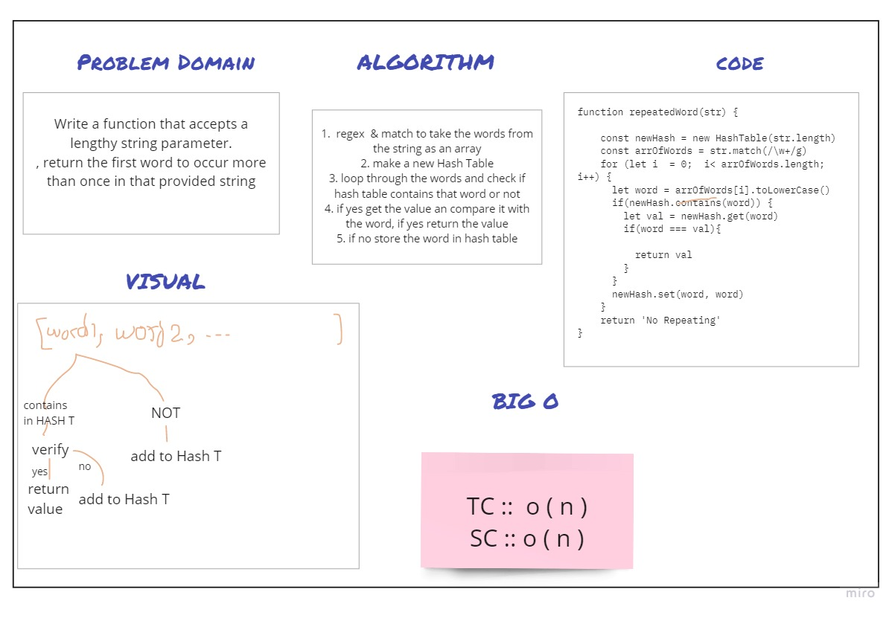

# Challenge Summary
Find the first repeated word in a book.

## Feature Tasks
Write a function that accepts a lengthy string parameter, return the first word to occur more 
than once in that provided string.

## Approach & Efficiency
+  TC ``O(n)``
+  SC ``O(n)``

## Solution

