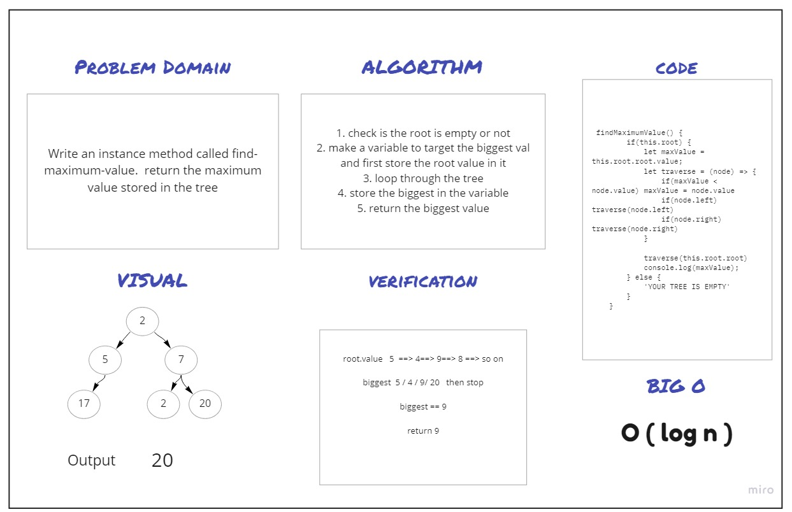

# Trees

Tree : is a non-linear data structure allows us to store, search , add values or nodes with efficient Time complexity  

## Challenge

+ Create a BinaryTree class with three traversal methods
+ Create a BinarySearchTree class that have two methods, one for add nodes, and another for searching for a value 

## Approach & Efficiency

Big O ==> O( log n ) 

## API
<!-- Description of each method publicly available in each of your trees -->


## ---------------------------------------------------

# find-maximum-value

## Challenge Summary
Write an instance method called find-maximum-value.  return the maximum value stored in the tree

## Whiteboard Process

## Approach & Efficiency
Big O ===> O ( log n )

## Solution
```
root.value   5  ==> 4==> 9==> 8 ==> so on

biggest  5 / 4 / 9/ 20   then stop

biggest == 9

return 9


```

